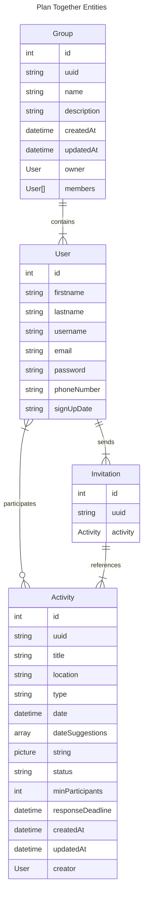

```mermaid
---
title: Plan Together Entities
---
    erDiagram
        User ||--|{ Invitation: sends
        User }|--o{ Activity: participates
        Group ||--|{ User: contains
        Invitation ||--|{ Activity: references
    
        User {
            int id
            string firstname
            string lastname
            string username
            string email
            string password
            string phoneNumber
            string signUpDate
        }
        
        Group {
            int id
            string uuid
            string name
            string description
            datetime createdAt
            datetime updatedAt
            User owner
            User[] members
        }
        
        Activity {
            int id
            string uuid
            string title
            string location
            string type
            datetime date
            array dateSuggestions
            picture string
            string status
            int minParticipants
            datetime responseDeadline
            datetime createdAt
            datetime updatedAt
            User creator
        }
        
        Invitation {
            int id
            string uuid
            Activity activity
        }
```